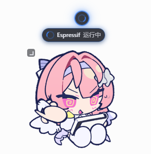

# OMPet — A Codex-Inspired Desktop Pet for OMP

[](LICENSE)

**English** | [简体中文](README.zh-CN.md)

> A desktop companion inspired by Codex pets that reuses Codex-compatible pet bundles to visualize OMP session status.

OMPet is a desktop pet plugin for the [Oh My Pi](https://github.com/oh-my-pi/oh-my-pi) (OMP) agent framework. It is inspired by Codex pets and can use existing Codex-compatible pet bundles directly, without converting their assets. The extension collects OMP session state, while the desktop app renders the pet and provides session navigation.

## Screenshots

The screenshots below show OMPet monitoring multiple OMP sessions with compact status bubbles and an expanded session status capsule.




The pet shown in these screenshots comes from the [remilia-codex-pet repository](https://github.com/jarvisluk/remilia-codex-pet). Its original pet bundle is not included or redistributed in this project; the screenshots are demonstration images only. OMPet can load Codex-compatible pet bundles directly from the local directories described below.

## Core features

- **OMP session status visualization** — maps session activity such as running, waiting for approval, and idle to different pet animations.
- **Multi-session monitoring** — shows one status bubble for each active OMP session, with visual differences for their states.
- **Precise terminal navigation** — clicking the pet or a session bubble focuses the corresponding OMP terminal; session-level terminal titles prevent clicks from being redirected to another task when several sessions are open.
- **Direct Codex pet reuse** — loads Codex-compatible bundles from the local pet directories without modifying their `pet.json` files.
- **Panel configuration** — `/ompet` lets you enable or disable the plugin, switch pets, and configure animation-row mappings for each state. `/onmypet` remains available as a compatibility alias.
- **Desktop interaction** — supports dragging, corner resizing, idle and directional animations, tray residency, and single-instance behavior.
- **Local and lightweight** — uses Canvas rendering and local files only; it does not require network access or telemetry.

## How it works

1. `bun scripts/build-extension.ts` builds the extension bundle and deploys the extension and any locally available pet bundles to the OMP directories; if the desktop executable has already been built, it deploys that too.
2. The extension listens to OMP lifecycle events and writes one local snapshot for each session.
3. The desktop app reads the snapshots and global configuration, then updates the pet animation, session bubbles, and active-session target.
4. Use `/ompet` to change the pet or animation mappings, or click the pet and bubbles to return to the relevant terminal.

## Quick start

**To run**: bun ≥ 1.3, Windows 10+, and WebView2 (included with supported Windows installations).

**To build the desktop app**: a Rust toolchain and the Windows build prerequisites required by Tauri 2.

```bash
# On a fresh checkout, or when the desktop executable is absent, build it first
bun install
cd desktop
bun install
bunx tauri build --no-bundle --ci
cd ..

# Deploy the extension and any local pet bundles
bun scripts/build-extension.ts

# Restart your omp session so the extension loads at startup
```

`scripts/build-extension.ts` does not download or build the desktop executable. It only copies `desktop/src-tauri/target/release/ompet-desktop.exe` when that file exists.

## Usage

| Entry | What it does |
|---|---|
| `/ompet` | Open the pet panel, switch pets, configure animation-row mappings, or toggle the plugin. |
| Desktop pet | Drag to move, drag the corner to resize, click the pet to focus the selected session, or click a bubble to focus its matching session. |

## Use your Codex pet

OMPet reads Codex-compatible pet bundles directly. Put a pet bundle containing `pet.json` and the file declared by `spritesheetPath` (usually `spritesheet.webp`) in one of these directories, then select it from `/ompet`:

- `~/.codex/pets/<id>/` — Codex pet directory, read-only to OMPet.
- `~/.omp/ompet/pets/<id>/` — OMPet's local pet directory.

The settings panel stores animation-row mappings in OMPet's global configuration; it does not write OMPet-specific metadata back into Codex pet files.

> Sample pet assets are not included in Git because of asset licensing. The build script copies local `remilia/` and `elaina-2/` bundles when they are present; otherwise, prepare your own pet bundle in one of the directories above. The original bundle for the external pet shown in the screenshots is not part of this repository.

## Local files

| Path | Purpose |
|---|---|
| `~/.omp/ompet/config.json` | Global plugin settings, active pet, and animation-row mappings. |
| `~/.omp/ompet/run/<encodedSessionId>.json` | Local snapshot for one OMP session. |
| `~/.omp/agent/extensions/ompet/` | Deployed extension files and desktop executable. |

## Project structure

| Path | Responsibility |
|---|---|
| `extension/` | OMP lifecycle integration, session snapshots, pet discovery, and the `/ompet` panel. |
| `desktop/` | Tauri desktop window, pet rendering, session bubbles, and terminal focusing. |
| `packages/shared/` | Shared pet contract, session states, configuration types, and snapshot types. |
| `scripts/build-extension.ts` | Builds and deploys the extension and locally available pet bundles. |

## License

[MIT](LICENSE) © LuaNMaT
